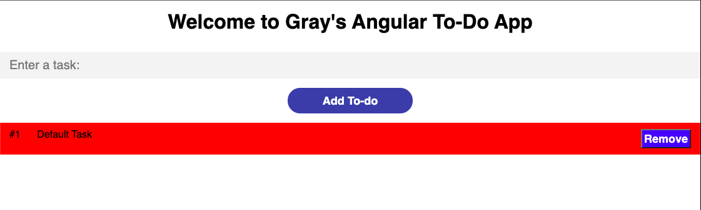
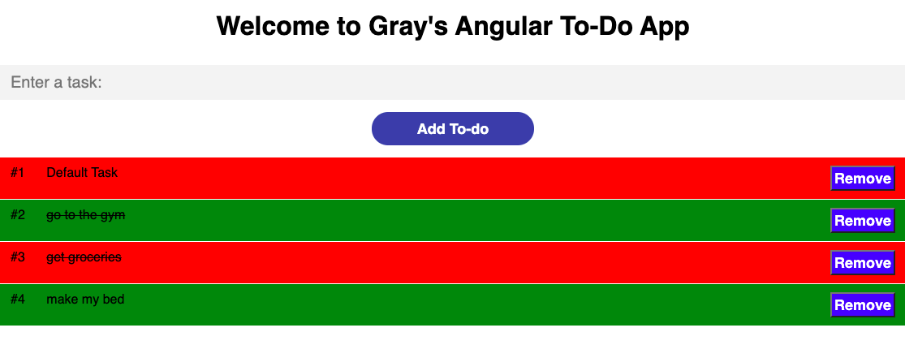

# Angular-MyToDo -> README.md

This is a task tracker app created by Angular. The app loads with a default task named 'Default Task'. To add more tasks to the to-do list, enter in the task in the text field and click the Add To-Do button. To remove a task, click the Remove button on the right hand side of each task. To mark a task as completed, click the task in the to-do list and it will put a line through the task - marking it as done. To undo it, click the task again and the line will go away. Each task is also numbered, and every other task has a different color.

Here are some examples:

